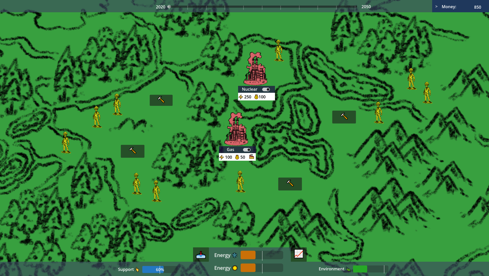

# SURE_WP3
The goal of this project is to create an energy-tycoon style game where the player has to make decisions about how they manage, develop and maintain the Swiss energy grid as it attempts to transition to a purely sustainable future by 2050. Throughout our turn-based game, the energy minister (a.k.a. the player) is confronted with a series of societal or environmental shocks which can disrupt the grid. In response to this, they can implement policies which will mitigate the impacts of these shocks all while impacting their political support amongst the people. Given that Switzerland is a Direct Democracy, the people's support is required to get anything done, so it's important to keep the political landscape of the country in mind when implementing new energy policies. 

## Inspiration  
Certain existing games can be used as inspiration to understand the goal of this project:  
  - [Power The Grid](https://claudioa.itch.io/power-the-grid): This is a similar style game, where the goal is to transition a local energy grid towards being able to decomission a coal plant. The art style and core plant management systems in our game were
  - [Frostpunk](https://www.frostpunkgame.com/): This game is a lot more gritty and bleak but uses a similar structure in terms of the political support system.

    
